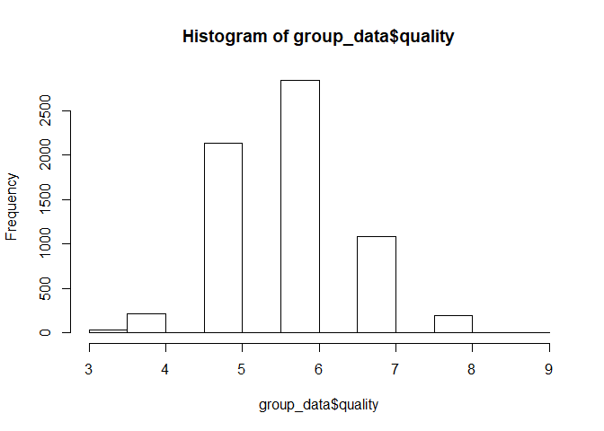
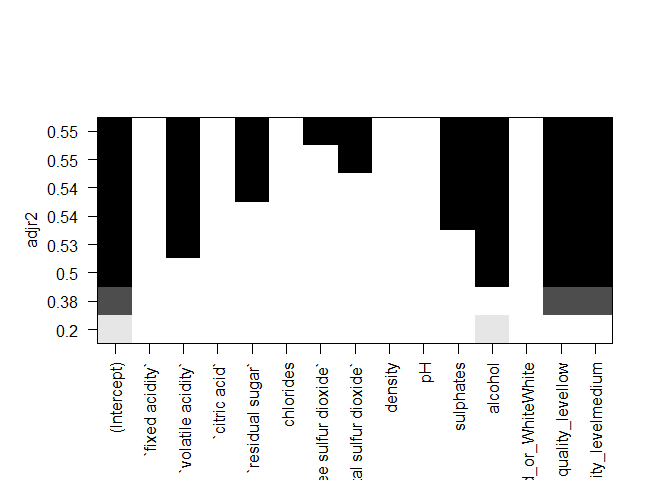
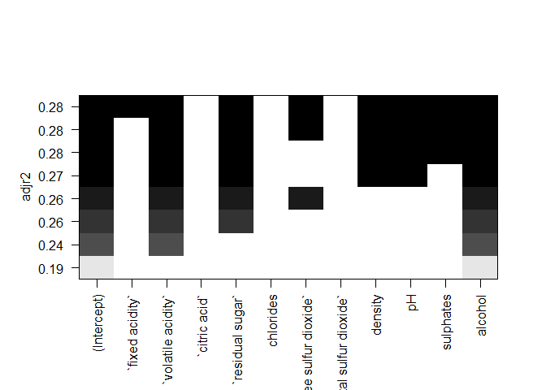
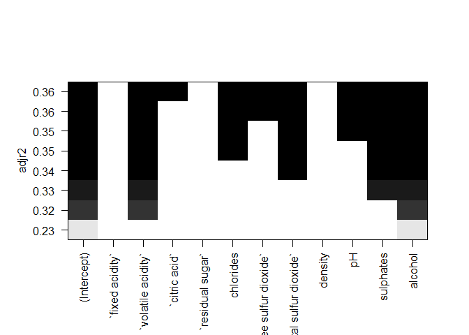
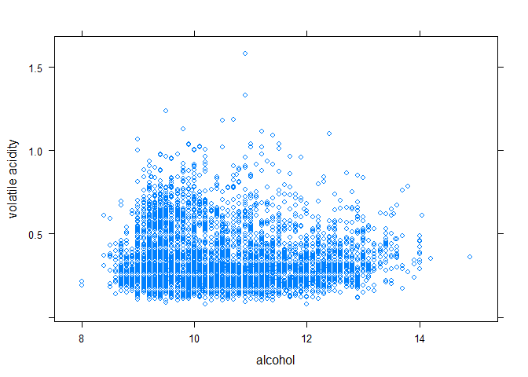
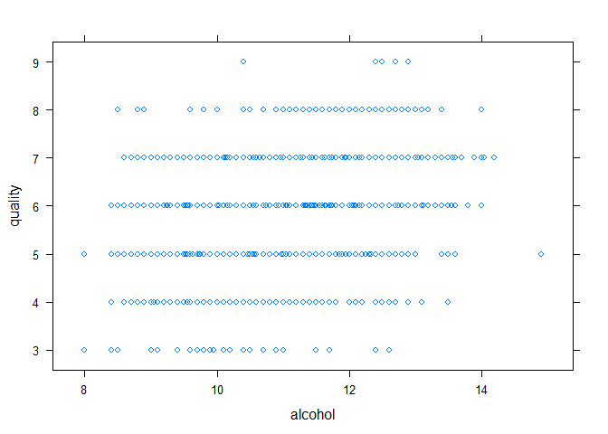

Group\_Project
================
Pacers Worldwide - Ana, Jeffrey, Sneha, Wiroon
11/24/2019

``` r
require(tidyverse)
```

    ## Loading required package: tidyverse

    ## -- Attaching packages -------------------------------------------------------------------------------------------------- tidyverse 1.3.0 --

    ## v ggplot2 3.2.1     v purrr   0.3.3
    ## v tibble  2.1.3     v dplyr   0.8.4
    ## v tidyr   1.0.2     v stringr 1.4.0
    ## v readr   1.3.1     v forcats 0.4.0

    ## -- Conflicts ----------------------------------------------------------------------------------------------------- tidyverse_conflicts() --
    ## x dplyr::filter() masks stats::filter()
    ## x dplyr::lag()    masks stats::lag()

``` r
require(dplyr)
require(lattice)
```

    ## Loading required package: lattice

``` r
require(ggplot)
```

    ## Loading required package: ggplot

    ## Warning in library(package, lib.loc = lib.loc, character.only = TRUE,
    ## logical.return = TRUE, : there is no package called 'ggplot'

``` r
require('leaps')
```

    ## Loading required package: leaps

``` r
red_data = read_csv('winequality_red.csv')
```

    ## Parsed with column specification:
    ## cols(
    ##   `fixed acidity` = col_double(),
    ##   `volatile acidity` = col_double(),
    ##   `citric acid` = col_double(),
    ##   `residual sugar` = col_double(),
    ##   chlorides = col_double(),
    ##   `free sulfur dioxide` = col_double(),
    ##   `total sulfur dioxide` = col_double(),
    ##   density = col_double(),
    ##   pH = col_double(),
    ##   sulphates = col_double(),
    ##   alcohol = col_double(),
    ##   quality = col_double()
    ## )

``` r
white_data = read_csv('winequality_white.csv')
```

    ## Parsed with column specification:
    ## cols(
    ##   `fixed acidity` = col_double(),
    ##   `volatile acidity` = col_double(),
    ##   `citric acid` = col_double(),
    ##   `residual sugar` = col_double(),
    ##   chlorides = col_double(),
    ##   `free sulfur dioxide` = col_double(),
    ##   `total sulfur dioxide` = col_double(),
    ##   density = col_double(),
    ##   pH = col_double(),
    ##   sulphates = col_double(),
    ##   alcohol = col_double(),
    ##   quality = col_double()
    ## )

``` r
group_data = read_csv('winequality_redandwhite.csv')
```

    ## Parsed with column specification:
    ## cols(
    ##   `fixed acidity` = col_double(),
    ##   `volatile acidity` = col_double(),
    ##   `citric acid` = col_double(),
    ##   `residual sugar` = col_double(),
    ##   chlorides = col_double(),
    ##   `free sulfur dioxide` = col_double(),
    ##   `total sulfur dioxide` = col_double(),
    ##   density = col_double(),
    ##   pH = col_double(),
    ##   sulphates = col_double(),
    ##   alcohol = col_double(),
    ##   quality = col_double(),
    ##   Red_or_White = col_character()
    ## )

## Introduction

### Brief description about the topic and the project.

**How does your project help those who are interested in this topic?**

We are working with a dataset of more than 6000 different wines,
including both red and white wines. For those interested in wine and
particularly wine consumption, our project will help wine aficionados
make informed decisions when choosing wine and help understand factors
that help explain qualitative wine levels. By converting the numerical
qualitative field to categorical we can than make distinctions between
higher and lower quality wines as well as see variances between red and
white based on quality.

##### \_\_\_\_\_\_\_\_\_\_\_\_\_\_\_\_\_\_\_\_\_\_\_\_\_\_\_\_\_\_\_\_\_\_\_\_\_\_\_\_\_\_\_\_\_\_\_\_\_\_\_\_\_\_\_\_\_\_\_\_\_\_\_\_\_\_\_\_\_\_\_\_\_\_\_\_\_\_\_\_\_\_\_\_\_\_\_\_\_\_\_\_\_\_\_\_\_\_\_\_\_\_\_\_\_\_\_\_\_\_\_\_\_\_\_\_\_\_\_\_\_\_\_\_\_\_\_\_\_\_\_\_\_\_\_\_\_\_\_

**Why data analysis is needed for this?**

Data analysis is needed for this for many reasons. There are many
different kinds of wine and even for people knowledgeable in this topic
they can get overwhelmed when going into a store and picking a wine for
a particular occasion. With data analysis we can compare similarities
and differences and categorize wine. With so many options out there
getting precise calculations provides individuals with the information
needed to make the best decisions for their wine purchases. For example
if an individual has had a bad day and just wants to drink their sorrows
away, a lower quality wine of lower price may do the job for them while
when trying to impress a spouse who loves wine and on a special occasion
may call for a higher quality wine. The information provided from this
analysis will hopefully provide some additional insight to the best
decisions for wine selection.

##### \_\_\_\_\_\_\_\_\_\_\_\_\_\_\_\_\_\_\_\_\_\_\_\_\_\_\_\_\_\_\_\_\_\_\_\_\_\_\_\_\_\_\_\_\_\_\_\_\_\_\_\_\_\_\_\_\_\_\_\_\_\_\_\_\_\_\_\_\_\_\_\_\_\_\_\_\_\_\_\_\_\_\_\_\_\_\_\_\_\_\_\_\_\_\_\_\_\_\_\_\_\_\_\_\_\_\_\_\_\_\_\_\_\_\_\_\_\_\_\_\_\_\_\_\_\_\_\_\_\_\_\_\_\_\_\_\_\_\_

**How do you expect your analysis to improve decision making in this
area?**

The analysis and predictions could help wine aficionados make more
informed wine purchases that is more tailored to their preferences. For
example, one may prefer red wine, but they would also want it to have a
low sugar content. This analysis could help individuals choose a red
wine with lower sugar content. Similarly, the analysis could also help
restaurant owners distinguish the different types of red and white wine
and mark their prices accordingly. For example, the analysis could find
correlations between white wines with high PH levels tend to have higher
quality, therefore, the price for that wine should be higher.

##### \_\_\_\_\_\_\_\_\_\_\_\_\_\_\_\_\_\_\_\_\_\_\_\_\_\_\_\_\_\_\_\_\_\_\_\_\_\_\_\_\_\_\_\_\_\_\_\_\_\_\_\_\_\_\_\_\_\_\_\_\_\_\_\_\_\_\_\_\_\_\_\_\_\_\_\_\_\_\_\_\_\_\_\_\_\_\_\_\_\_\_\_\_\_\_\_\_\_\_\_\_\_\_\_\_\_\_\_\_\_\_\_\_\_\_\_\_\_\_\_\_\_\_\_\_\_\_\_\_\_\_\_\_\_\_\_\_\_\_

### Describe your data

**What is the source?**

This dataset was found in data.world
(<https://data.world/food/wine-quality>). The source provided the data
for white and red wine in 2x seperate data sources. We had to
concatenate the sources together and add a qualitative field to
determine red and white wines from each set. The adjusted CSV file is
included with this report where all analysis was performed.

##### \_\_\_\_\_\_\_\_\_\_\_\_\_\_\_\_\_\_\_\_\_\_\_\_\_\_\_\_\_\_\_\_\_\_\_\_\_\_\_\_\_\_\_\_\_\_\_\_\_\_\_\_\_\_\_\_\_\_\_\_\_\_\_\_\_\_\_\_\_\_\_\_\_\_\_\_\_\_\_\_\_\_\_\_\_\_\_\_\_\_\_\_\_\_\_\_\_\_\_\_\_\_\_\_\_\_\_\_\_\_\_\_\_\_\_\_\_\_\_\_\_\_\_\_\_\_\_\_\_\_\_\_\_\_\_\_\_\_\_

**What are your variables? If there are too many, focus on the ones that
you will explore**

  - Fixed acidity: A measurement of the quantity of acid in a wine. It
    determines how a wine will taste, feel, and how well it will age.
    (“Understanding Wine Acidity.”)

  - Volatile acidity: A measure of the wine’s gaseous acids. These acids
    are responsible for how the wine smells. (Penn State Extension)

  - Citric acid: “Citric acid specifically makes a wine taste fresh and
    is best used in balancing a malic dominant fruit base.” (WineFrog)

  - Residual sugar: Sugar from the grapes after the alcoholic
    fermentation process finishes.
    (<https://www.facebook.com/WineFolly>)

  - Chlorides: The measure of salts in the wine. (Coli et al.)

  - Free sulfur dioxide: It is also known as Sulphites that affect the
    wine’s odour. The more free sulfur dioxide, the more pungent odour
    in the wine. This free sulfur dioxide is a part of sulfur dioxide
    which is said to be free when added into the wine after its
    remaining part binds.(Cortez et al, 2009)

  - Total sulfur dioxide: It is the sum total of the bound and free
    sulfur dioxide. It is generally added in the wine by winemakers to
    kill harmful bacteria and keep the wine fresh and thus maintain its
    quality.However an excessive amount of this in wine causes killing
    of the good yeast. (Cortez et al., 2009)

  - Density: It is mass per weight or volume of the wine. Mass/Volume

  - pH: Measurement of the strengths of the acids. (“Understanding Wine
    Acidity.”)

  - Sulphates: Mineral salt containing sulfur. Its content affects the
    wine aroma and flavor.(Cortez et al., 2009)

  - Alcohol: Formed due to the conversion of yeast into sugar during the
    fermentation process.The more the alcohol content in the wine, the
    more bolder and oily it is in taste. (Cortez et al., 2009)

  - Quality - a integer based range that determines quality based on
    other factors (assuming most are included in this dataset but may
    have additional outliers)

##### \_\_\_\_\_\_\_\_\_\_\_\_\_\_\_\_\_\_\_\_\_\_\_\_\_\_\_\_\_\_\_\_\_\_\_\_\_\_\_\_\_\_\_\_\_\_\_\_\_\_\_\_\_\_\_\_\_\_\_\_\_\_\_\_\_\_\_\_\_\_\_\_\_\_\_\_\_\_\_\_\_\_\_\_\_\_\_\_\_\_\_\_\_\_\_\_\_\_\_\_\_\_\_\_\_\_\_\_\_\_\_\_\_\_\_\_\_\_\_\_\_\_\_\_\_\_\_\_\_\_\_\_\_\_\_\_\_\_\_

**Describe the data cleaning process if you needed**

There was some small cleaning of the dataset. Two new columns were
added: “Red\_or\_White” and categorical column for quality. The data for
the red and white wine were on two seperate files, we merged those two
files into one. To identify which attributes belonged to red wine and
which attributes belonged to white wine, the “Red\_or\_White” column was
added. The categorical quality column was added to better gauge the
quality of the wine, the quality can now be classified as “low”,
“medium”, or “high.”

##### \_\_\_\_\_\_\_\_\_\_\_\_\_\_\_\_\_\_\_\_\_\_\_\_\_\_\_\_\_\_\_\_\_\_\_\_\_\_\_\_\_\_\_\_\_\_\_\_\_\_\_\_\_\_\_\_\_\_\_\_\_\_\_\_\_\_\_\_\_\_\_\_\_\_\_\_\_\_\_\_\_\_\_\_\_\_\_\_\_\_\_\_\_\_\_\_\_\_\_\_\_\_\_\_\_\_\_\_\_\_\_\_\_\_\_\_\_\_\_\_\_\_\_\_\_\_\_\_\_\_\_\_\_\_\_\_\_\_\_

**1. What is the distribution of wine in the data set? Red vs White &
Quality?**

``` r
group_data
```

    ## # A tibble: 6,497 x 13
    ##    `fixed acidity` `volatile acidi~ `citric acid` `residual sugar` chlorides
    ##              <dbl>            <dbl>         <dbl>            <dbl>     <dbl>
    ##  1             7.4            0.7            0                 1.9     0.076
    ##  2             7.8            0.88           0                 2.6     0.098
    ##  3             7.8            0.76           0.04              2.3     0.092
    ##  4            11.2            0.28           0.56              1.9     0.075
    ##  5             7.4            0.7            0                 1.9     0.076
    ##  6             7.4            0.66           0                 1.8     0.075
    ##  7             7.9            0.6            0.06              1.6     0.069
    ##  8             7.3            0.65           0                 1.2     0.065
    ##  9             7.8            0.580          0.02              2       0.073
    ## 10             7.5            0.5            0.36              6.1     0.071
    ## # ... with 6,487 more rows, and 8 more variables: `free sulfur dioxide` <dbl>,
    ## #   `total sulfur dioxide` <dbl>, density <dbl>, pH <dbl>, sulphates <dbl>,
    ## #   alcohol <dbl>, quality <dbl>, Red_or_White <chr>

``` r
hist(group_data$quality)
```

<!-- -->

``` r
quantile(group_data$quality)
```

    ##   0%  25%  50%  75% 100% 
    ##    3    5    6    6    9

``` r
mean(group_data$quality)
```

    ## [1] 5.818378

``` r
median(group_data$quality)
```

    ## [1] 6

``` r
group_data %>% group_by(Red_or_White, quality) %>%  count() %>% arrange(desc(quality))
```

    ## # A tibble: 13 x 3
    ## # Groups:   Red_or_White, quality [13]
    ##    Red_or_White quality     n
    ##    <chr>          <dbl> <int>
    ##  1 White              9     5
    ##  2 Red                8    18
    ##  3 White              8   175
    ##  4 Red                7   199
    ##  5 White              7   880
    ##  6 Red                6   638
    ##  7 White              6  2198
    ##  8 Red                5   681
    ##  9 White              5  1457
    ## 10 Red                4    53
    ## 11 White              4   163
    ## 12 Red                3    10
    ## 13 White              3    20

``` r
group_data_2 =group_data %>% mutate(quality_level = case_when(
  quality <= 4 ~ 'low',
  quality > 4 & quality < 8  ~ 'medium',
  quality >= 8 ~ 'high'
))
group_data_2 %>% group_by(quality_level, Red_or_White) %>%  count() %>% arrange(desc(quality_level))
```

    ## # A tibble: 6 x 3
    ## # Groups:   quality_level, Red_or_White [6]
    ##   quality_level Red_or_White     n
    ##   <chr>         <chr>        <int>
    ## 1 medium        Red           1518
    ## 2 medium        White         4535
    ## 3 low           Red             63
    ## 4 low           White          183
    ## 5 high          Red             18
    ## 6 high          White          180

Based on the histogram and breakout of qualities (red vs white wine) we
can determine the following:

  - Based on the histogram, we determined quality can be viewed in
    categorical format. (high, medium, low)

  - Based on distribution of histogram, levels are determined based on
    \<5 = low quality, \>7 high quality, else = medium quality.

  - We understand that high quality and low quality are a dramatically
    lower frequency than medium quality, we are hoping that the samples
    sets of low and high quality wine can help determine unique factors
    that differentiate between high and low quality.

  - Second graph shows distribution by quality by red or white wine
    counts.

  - Thirs graph shows the categorical distribution based on our
    quality\_level dimension.

  - From here we will work to determine unique variance between high &
    low quality.

##### \_\_\_\_\_\_\_\_\_\_\_\_\_\_\_\_\_\_\_\_\_\_\_\_\_\_\_\_\_\_\_\_\_\_\_\_\_\_\_\_\_\_\_\_\_\_\_\_\_\_\_\_\_\_\_\_\_\_\_\_\_\_\_\_\_\_\_\_\_\_\_\_\_\_\_\_\_\_\_\_\_\_\_\_\_\_\_\_\_\_\_\_\_\_\_\_\_\_\_\_\_\_\_\_\_\_\_\_\_\_\_\_\_\_\_\_\_\_\_\_\_\_\_\_\_\_\_\_\_\_\_\_\_\_\_\_\_\_\_

**2. What variables determine quality of wine?**

``` r
lps=regsubsets(quality~., data = group_data_2)
plot(lps, scale='adjr2')
```

<!-- -->

Based on this the strongest variables to determine overall wine quality
are:

  - Volatile Acidity
  - Residual Sugar
  - Free sulphur dioxide & total sulphur dioxide
  - Sulphates
  - Alcohol

##### \_\_\_\_\_\_\_\_\_\_\_\_\_\_\_\_\_\_\_\_\_\_\_\_\_\_\_\_\_\_\_\_\_\_\_\_\_\_\_\_\_\_\_\_\_\_\_\_\_\_\_\_\_\_\_\_\_\_\_\_\_\_\_\_\_\_\_\_\_\_\_\_\_\_\_\_\_\_\_\_\_\_\_\_\_\_\_\_\_\_\_\_\_\_\_\_\_\_\_\_\_\_\_\_\_\_\_\_\_\_\_\_\_\_\_\_\_\_\_\_\_\_\_\_\_\_\_\_\_\_\_\_\_\_\_\_\_\_\_

**3. Are there differences between white and red wine that are more
informative where variables can determine white or red?**

``` r
group_data_2_White = group_data_2 %>% filter(Red_or_White == 'White')
group_data_2_Red = group_data_2 %>% filter(Red_or_White == 'Red')


lps_white=regsubsets(quality~., data = white_data)
plot(lps_white, scale='adjr2')
```

<!-- -->

``` r
lps_red=regsubsets(quality~., data = red_data)
plot(lps_red, scale='adjr2')
```

<!-- --> The
quality of Red wines can be defined with the following variables:

  - Volatile acidity
  - Citric acid
  - Chlorides
  - Free & Total sulfur dioxide
  - PH
  - Sulphates
  - Alcohol

The quality of White wines can be defined with the following variables:

  - Fixed acidity
  - Volatile acidity
  - Residual Sugar
  - Free sulfur dioxide
  - Density
  - PH
  - Sulphates
  - Alcohol

##### \_\_\_\_\_\_\_\_\_\_\_\_\_\_\_\_\_\_\_\_\_\_\_\_\_\_\_\_\_\_\_\_\_\_\_\_\_\_\_\_\_\_\_\_\_\_\_\_\_\_\_\_\_\_\_\_\_\_\_\_\_\_\_\_\_\_\_\_\_\_\_\_\_\_\_\_\_\_\_\_\_\_\_\_\_\_\_\_\_\_\_\_\_\_\_\_\_\_\_\_\_\_\_\_\_\_\_\_\_\_\_\_\_\_\_\_\_\_\_\_\_\_\_\_\_\_\_\_\_\_\_\_\_\_\_\_\_\_\_

**4. Based on question 2 & 3, volatile acidity and alcohol are the
strongest variables that determine quality of wine. What is the
relationship between volatile acidity and alcohol in wine?**

``` r
xyplot(`volatile acidity` ~ alcohol, group_data_2)
```

<!-- -->

``` r
my_model = lm(`volatile acidity`~ alcohol, data = group_data_2)
summary(my_model)
```

    ## 
    ## Call:
    ## lm(formula = `volatile acidity` ~ alcohol, data = group_data_2)
    ## 
    ## Residuals:
    ##      Min       1Q   Median       3Q      Max 
    ## -0.26118 -0.11391 -0.04651  0.06525  1.24245 
    ## 
    ## Coefficients:
    ##              Estimate Std. Error t value Pr(>|t|)    
    ## (Intercept)  0.394178   0.018073  21.810  < 2e-16 ***
    ## alcohol     -0.005196   0.001712  -3.036  0.00241 ** 
    ## ---
    ## Signif. codes:  0 '***' 0.001 '**' 0.01 '*' 0.05 '.' 0.1 ' ' 1
    ## 
    ## Residual standard error: 0.1645 on 6495 degrees of freedom
    ## Multiple R-squared:  0.001417,   Adjusted R-squared:  0.001263 
    ## F-statistic: 9.215 on 1 and 6495 DF,  p-value: 0.00241

Scatter plot and linear model summary show that there is no relationship
between volatile acidity and alcohol. Based on the linear model, an unit
increase in alcohol adjust volatile acidity by such a small margin, it
does not show a relevant correlation between the two.

##### \_\_\_\_\_\_\_\_\_\_\_\_\_\_\_\_\_\_\_\_\_\_\_\_\_\_\_\_\_\_\_\_\_\_\_\_\_\_\_\_\_\_\_\_\_\_\_\_\_\_\_\_\_\_\_\_\_\_\_\_\_\_\_\_\_\_\_\_\_\_\_\_\_\_\_\_\_\_\_\_\_\_\_\_\_\_\_\_\_\_\_\_\_\_\_\_\_\_\_\_\_\_\_\_\_\_\_\_\_\_\_\_\_\_\_\_\_\_\_\_\_\_\_\_\_\_\_\_\_\_\_\_\_\_\_\_\_\_\_

**5. After finding no significant relationship between volatile acidity
and alcohol, can we find that there is a stronger relationship between
alcohol & quality?**

``` r
xyplot(quality ~ alcohol, group_data_2)
```

<!-- -->

``` r
my_model2 = lm(quality ~ alcohol, data = group_data_2)
summary(my_model2)
```

    ## 
    ## Call:
    ## lm(formula = quality ~ alcohol, data = group_data_2)
    ## 
    ## Residuals:
    ##     Min      1Q  Median      3Q     Max 
    ## -3.5042 -0.4957 -0.0488  0.5043  3.2115 
    ## 
    ## Coefficients:
    ##             Estimate Std. Error t value Pr(>|t|)    
    ## (Intercept) 2.405269   0.085941   27.99   <2e-16 ***
    ## alcohol     0.325312   0.008139   39.97   <2e-16 ***
    ## ---
    ## Signif. codes:  0 '***' 0.001 '**' 0.01 '*' 0.05 '.' 0.1 ' ' 1
    ## 
    ## Residual standard error: 0.7824 on 6495 degrees of freedom
    ## Multiple R-squared:  0.1974, Adjusted R-squared:  0.1973 
    ## F-statistic:  1598 on 1 and 6495 DF,  p-value: < 2.2e-16

While there isn’t a very strong relationship, we can say it is a
stronger relationship and for every unit increase in alcohol, we can
expect an increase in the quality by .32 per unit of alcohol.

##### \_\_\_\_\_\_\_\_\_\_\_\_\_\_\_\_\_\_\_\_\_\_\_\_\_\_\_\_\_\_\_\_\_\_\_\_\_\_\_\_\_\_\_\_\_\_\_\_\_\_\_\_\_\_\_\_\_\_\_\_\_\_\_\_\_\_\_\_\_\_\_\_\_\_\_\_\_\_\_\_\_\_\_\_\_\_\_\_\_\_\_\_\_\_\_\_\_\_\_\_\_\_\_\_\_\_\_\_\_\_\_\_\_\_\_\_\_\_\_\_\_\_\_\_\_\_\_\_\_\_\_\_\_\_\_\_\_\_\_

### Summary of findings & prediction method:

  - Based on findings, we see that using multiple variables is the only
    way to determine quality and distinction between red and white
    wines. While trying to find strong relationships between specific
    variables, there was no strong unique identifying variable. For our
    predicitve model it will be important to use the variables.

  - Our prediction method is based on finding the following variables
    will best predict quality of wine:

  - Volatile Acidity

  - Residual Sugar

  - Free sulphur dioxide & total sulphur dioxide

  - Sulphates

  - Alcohol

  - Our prediction method is there will be distinguished differences
    between high vs low quality wines of the same type (red or white).

### Works Cited

P. Cortez, A. Cerdeira, F. Almeida, T. Matos and J. Reis. Modeling wine
preferences by data mining from physicochemical properties. In Decision
Support Systems, Elsevier, 47(4):547-553. ISSN: 0167-9236.

Admin. “Understanding Wine Acidity.” Winemaker’s Academy, 25 June 2018,
<http://winemakersacademy.com/understanding-wine-acidity/>.

WineFrog. “Citric Acid.” WineFrog.Com, WineFrog, 21 Oct. 2015,
www.winefrog.com/definition/243/citric-acid.

<https://www.facebook.com/WineFolly>. “What Is Residual Sugar in Wine? |
Wine Folly.” Wine Folly, 18 Mar. 2019,
winefolly.com/review/what-is-residual-sugar-in-wine/.

Penn State Extension. “Volatile Acidity in Wine.” Penn State Extension,
23 May 2019, extension.psu.edu/volatile-acidity-in-wine.

Coli, Marina Sonegheti, et al. “Chloride Concentration in Red Wines:
Influence of Terroir and Grape Type.” Food Science and Technology
(Campinas), vol. 35, no. 1, Mar. 2015, pp. 95–99,
<doi:10.1590/1678-457x.6493>. (Cortez et al., 2009)
<https://www.kaggle.com/mgmarques/wines-type-and-quality-classification-exercises/data>
